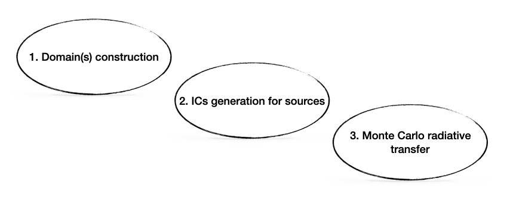

# Workflow

In the first step, we build the mesh describing the scattering medium. Depending of the (chosen) domain decomposition, one or various mesh files are built (one mesh per domain). There is basically two ways of using RASCAS. The first usage is to use idealised models to describe the scattering medium. These models are analytic description of both the density and velocity profiles. The code ``GenerateAMRmodel`` project these distributions on an adaptive mesh. We will give examples in the first series of tutorials. The second usage is to use an output of a (RAMSES) simulation to describe the scattering medium. In practise, we read the RAMSES output, extract cells in a volume of interests, convert some properties, and build the mesh(es). The code to do that is ``CreateDomDump``. We will give examples in the second series of tutorials.

The second step is the modeling of the sources of radiation. Radiation is emitted from sources in the form of « photon packets ».
Each photon packet carries the same weight (a number of real photons per unit time)
and is propagated independently of the others. There are various codes in the RASCAS package that can describe different sources (stars, gas, etc.). They all generate a Photon Packet Initial Conditions (PPIC) file. Various use cases are described in the tutorials.

The third step is the radiative transfer. It consists in running the ``rascas`` code. It is a parallel code (because this is, computationally speaking, the most expensive part, especially for Lyman-alpha). It is helpfull to run it on a supercomputer. It takes as an inputs the mesh files and the PPIC file, generated in the 2 previous steps. For some tests and quick experiments (as in the tutorials), it may useful to use a serial (not parallel) version of the code, this is the ``rascas-serial`` code.

